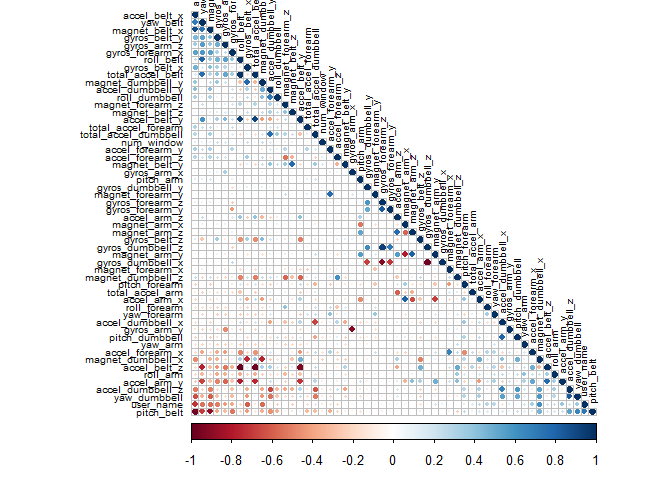
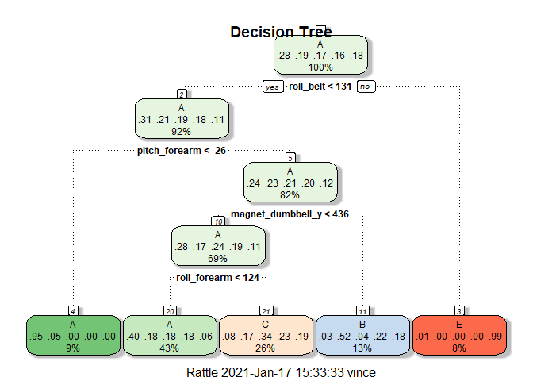
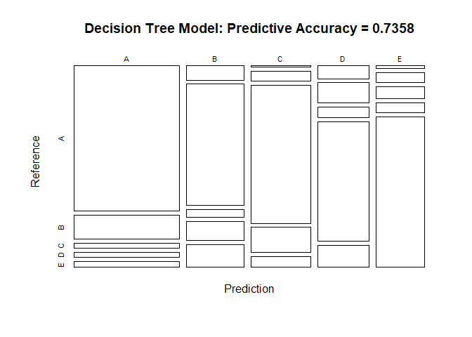

### Background

Using devices such as Jawbone Up, Nike FuelBand, and Fitbit it is now possible to collect a large amount of data about personal activity relatively inexpensively. These type of devices are part of the quantified self movement – a group of enthusiasts who take measurements about themselves regularly to improve their health, to find patterns in their behavior, or because they are tech geeks. One thing that people regularly do is quantify how much of a particular activity they do, but they rarely quantify how well they do it. In this project, your goal will be to use data from accelerometers on the belt, forearm, arm, and dumbell of 6 participants. They were asked to perform barbell lifts correctly and incorrectly in 5 different ways. More information is available from the website here: <http://web.archive.org/web/20161224072740/http:/groupware.les.inf.puc-rio.br/har> (see the section on the Weight Lifting Exercise Dataset).

### Data

The training data for this project are available here: <https://d396qusza40orc.cloudfront.net/predmachlearn/pml-training.csv>

The test data are available here: <https://d396qusza40orc.cloudfront.net/predmachlearn/pml-testing.csv>


The data for this project come from this source [see @HAR, pp. 52-61; also @HAR2, ISBN 978-3-642-34458-9. DOI: 10.1007/978-3-642-34459-6_6].


### Download Data

Download the data to a local folder to save processing time in future runs, and make sure that the test is based on the same results.


```r
# Check if CSV directory exit, create if not
if (!dir.exists("./csv")) {
  dir.create("./csv")
}

pmlTrainFile <- "./csv/pml-training.csv"

#check if file exist otherwise download
if (!file.exists(pmlTrainFile)) {
  pmlTrainingUrl <-"https://d396qusza40orc.cloudfront.net/predmachlearn/pml-training.csv"
  download.file(pmlTrainingUrl, destfile=pmlTrainFile, method="curl")
}

pmlTestFile <- "./csv/pml-testing.csv"

#check if file exist otherwise download
if (!file.exists(pmlTestFile)) {
  pmlTestUrl <- "https://d396qusza40orc.cloudfront.net/predmachlearn/pml-testing.csv"
  download.file(pmlTestUrl, destfile=pmlTestFile, method="curl")
}
```

### Read the Data

Load the data from CSV File downloaded into dataframe


```r
trainFull <- read.csv("./csv/pml-training.csv", na.strings=c("NA","#DIV/0!",""), stringsAsFactors=T)
testFull <- read.csv("./csv/pml-testing.csv", na.strings=c("NA","#DIV/0!",""), stringsAsFactors=T)
```
### Summary of the data

trainFull dimension


```r
dim(trainFull)
```

```
## [1] 19622   160
```

testFull dimension


```r
dim(testFull)
```

```
## [1]  20 160
```
### Cleaning the data

Remove all columns that contain Nulls (NA)


```r
trainClean <- trainFull[, colSums(is.na(trainFull)) == 0] 
testClean <- testFull[, colSums(is.na(testFull)) == 0] 
```

Remove columns that do not contribute to measurement


```r
columnRemove <- grepl("X|timestamp", names(testClean))

trainClean <- trainClean[, !columnRemove]
testClean <- testClean[, !columnRemove]
```

check for Near Zero 


```r
nZero <- nearZeroVar(trainClean)

trainClean <- trainClean[ , -nZero]
testClean  <- testClean [ , -nZero]
```


trainClean dimension - after removing columns and near zero variables


```r
dim(trainClean)
```

```
## [1] 19622    55
```
testClean dimension - after removing columns


```r
dim(testClean)
```

```
## [1] 20 55
```
Get number of records that contain full data across all classes in trainClean


```r
sum(complete.cases(trainClean))
```

```
## [1] 19622
```
Get number of records that contain full data across all classes in testClean


```r
sum(complete.cases(testClean))
```

```
## [1] 20
```

the cleaning process took the initial data from 160 variables down to 54 variables in the full and test dataset. 


Observation of classes


```r
table(trainClean$classe)
```

```
## 
##    A    B    C    D    E 
## 5580 3797 3422 3216 3607
```

```r
classeLevels <- levels(trainClean$classe)

trainClean <- data.frame(data.matrix(trainClean))
trainClean$classe <- factor(trainClean$classe, labels=classeLevels)
testClean <- data.frame(data.matrix(testClean))
```

## Analisys

Correlation analyses of variables before modeling using "FPC".


```r
corr_matrix <- cor(trainClean[ , -55])
corrplot(corr_matrix, order = "FPC", method = "circle", type = "lower", tl.cex = 0.6, tl.col = rgb(0, 0, 0))
```

<!-- -->
Darker colors represent higher correlation factor, Dark Red for negative correlation, and Dark Blue for Positive correlation. Further analysis of the data will be done to get more accurate results.

### Prediction Models

Using the clean training data we will now create 70/30 validation datasets.


```r
set.seed(20210110) 

inBuild <- createDataPartition(y=trainClean$classe, p=0.7, list=FALSE)
validation <- trainClean[-inBuild,]; 
buildData <- trainClean[inBuild,]

inTrain <- createDataPartition(y=buildData$classe, p=0.7, list=FALSE)
training <- buildData[inTrain,]; 
testing <- buildData[-inTrain,]

dim(training)
```

```
## [1] 9619   55
```

```r
dim(testing)
```

```
## [1] 4118   55
```

```r
dim(validation)
```

```
## [1] 5885   55
```

```r
#inTrain <- createDataPartition(y=trainClean$classe, p=0.75, list=FALSE)
#training <- trainClean[inTrain,]
#testing <- trainClean[-inTrain,]
```

Lets find the most relevant fields


```r
classeIndex <- which(names(training) == "classe")

correlations <- cor(training[, -classeIndex], as.numeric(training$classe))
bestCorrelations <- subset(as.data.frame(as.table(correlations)), abs(Freq)>0.3)
bestCorrelations
```

```
##             Var1 Var2      Freq
## 26  magnet_arm_x    A 0.3037748
## 43 pitch_forearm    A 0.3539372
```
The result would show that magent_arm_x and pitch_forearm have the best correlations.


```r
subset <- split(training, training$classe)
modFit <- train(classe ~ ., method="rpart", data=training)
fancyRpartPlot(modFit$finalModel, main="Decision Tree")
```

<!-- -->
Regression tree output - would generate too small using fancyRpartPlot


```r
modCART <- rpart(classe ~ ., data=training, method = "class")
modCART
```

```
## n= 9619 
## 
## node), split, n, loss, yval, (yprob)
##       * denotes terminal node
## 
##    1) root 9619 6884 A (0.28 0.19 0.17 0.16 0.18)  
##      2) roll_belt< 130.5 8814 6086 A (0.31 0.21 0.19 0.18 0.11)  
##        4) pitch_forearm< -26.45 881   40 A (0.95 0.045 0 0 0) *
##        5) pitch_forearm>=-26.45 7933 6046 A (0.24 0.23 0.21 0.2 0.12)  
##         10) magnet_dumbbell_y< 435.5 6676 4827 A (0.28 0.17 0.24 0.19 0.11)  
##           20) roll_forearm< 123.5 4127 2470 A (0.4 0.18 0.18 0.18 0.061)  
##             40) magnet_dumbbell_z< -24.5 1424  484 A (0.66 0.2 0.02 0.088 0.03)  
##               80) roll_forearm>=-136.5 1187  266 A (0.78 0.16 0.022 0.037 0.0034) *
##               81) roll_forearm< -136.5 237  142 B (0.08 0.4 0.013 0.34 0.16) *
##             41) magnet_dumbbell_z>=-24.5 2703 1975 C (0.27 0.17 0.27 0.22 0.078)  
##               82) num_window< 241.5 626   96 A (0.85 0 0 0.064 0.089) *
##               83) num_window>=241.5 2077 1349 C (0.09 0.22 0.35 0.27 0.074)  
##                166) accel_dumbbell_y< -40.5 296   29 C (0 0.061 0.9 0.037 0) *
##                167) accel_dumbbell_y>=-40.5 1781 1234 D (0.1 0.24 0.26 0.31 0.086)  
##                  334) roll_belt>=125.5 425  175 C (0 0.36 0.59 0.045 0.0094)  
##                    668) pitch_belt< -42.65 166   18 B (0 0.89 0 0.084 0.024) *
##                    669) pitch_belt>=-42.65 259    9 C (0 0.015 0.97 0.019 0) *
##                  335) roll_belt< 125.5 1356  828 D (0.14 0.21 0.16 0.39 0.11)  
##                    670) num_window< 278.5 162   77 C (0 0.48 0.52 0 0)  
##                     1340) num_window< 260 77    0 B (0 1 0 0 0) *
##                     1341) num_window>=260 85    0 C (0 0 1 0 0) *
##                    671) num_window>=278.5 1194  666 D (0.16 0.17 0.11 0.44 0.13)  
##                     1342) pitch_belt< -42.35 261  162 A (0.38 0.34 0.18 0.1 0.0077) *
##                     1343) pitch_belt>=-42.35 933  431 D (0.094 0.12 0.086 0.54 0.16) *
##           21) roll_forearm>=123.5 2549 1682 C (0.075 0.17 0.34 0.23 0.19)  
##             42) magnet_dumbbell_y< 291.5 1508  767 C (0.09 0.13 0.49 0.14 0.15)  
##               84) magnet_dumbbell_z>=285 214  108 A (0.5 0.13 0.042 0.084 0.25) *
##               85) magnet_dumbbell_z< 285 1294  562 C (0.022 0.13 0.57 0.15 0.13)  
##                170) num_window< 88.5 171   80 B (0.11 0.53 0 0 0.36) *
##                171) num_window>=88.5 1123  391 C (0.0098 0.069 0.65 0.17 0.096) *
##             43) magnet_dumbbell_y>=291.5 1041  680 D (0.055 0.22 0.12 0.35 0.26)  
##               86) roll_dumbbell< 45.42971 210   51 B (0.048 0.76 0.019 0.062 0.11) *
##               87) roll_dumbbell>=45.42971 831  483 D (0.057 0.087 0.15 0.42 0.29)  
##                174) accel_forearm_x< -79.5 382  100 D (0.071 0.034 0.052 0.74 0.1) *
##                175) accel_forearm_x>=-79.5 449  247 E (0.045 0.13 0.23 0.15 0.45) *
##         11) magnet_dumbbell_y>=435.5 1257  599 B (0.03 0.52 0.043 0.22 0.18)  
##           22) total_accel_dumbbell>=5.5 909  309 B (0.042 0.66 0.058 0.022 0.22)  
##             44) roll_belt>=-0.56 769  169 B (0.049 0.78 0.069 0.026 0.075) *
##             45) roll_belt< -0.56 140    0 E (0 0 0 0 1) *
##           23) total_accel_dumbbell< 5.5 348   88 D (0 0.17 0.0029 0.75 0.083) *
##      3) roll_belt>=130.5 805    7 E (0.0087 0 0 0 0.99) *
```
Predictions of the decision tree model on testing model.


```r
predict_decision_tree <- predict(modCART, newdata = testing, type="class")
conf_matrix_decision_tree <- confusionMatrix(predict_decision_tree, testing$classe)
conf_matrix_decision_tree
```

```
## Confusion Matrix and Statistics
## 
##           Reference
## Prediction    A    B    C    D    E
##          A 1056  173   37   39   43
##          B   56  478   31   75   90
##          C    6   41  571  105   44
##          D   45   71   38  422   77
##          E    8   34   41   34  503
## 
## Overall Statistics
##                                          
##                Accuracy : 0.7358         
##                  95% CI : (0.722, 0.7492)
##     No Information Rate : 0.2844         
##     P-Value [Acc > NIR] : < 2.2e-16      
##                                          
##                   Kappa : 0.6641         
##                                          
##  Mcnemar's Test P-Value : < 2.2e-16      
## 
## Statistics by Class:
## 
##                      Class: A Class: B Class: C Class: D Class: E
## Sensitivity            0.9018   0.5997   0.7953   0.6252   0.6645
## Specificity            0.9009   0.9241   0.9424   0.9329   0.9652
## Pos Pred Value         0.7834   0.6548   0.7445   0.6462   0.8113
## Neg Pred Value         0.9585   0.9058   0.9561   0.9270   0.9274
## Prevalence             0.2844   0.1935   0.1744   0.1639   0.1838
## Detection Rate         0.2564   0.1161   0.1387   0.1025   0.1221
## Detection Prevalence   0.3273   0.1773   0.1863   0.1586   0.1506
## Balanced Accuracy      0.9014   0.7619   0.8688   0.7790   0.8148
```
We come up with and 82% accuracy rate. This would still be considered low as it is below 90%.

Generate Plot from the confusion matrix


```r
plot(conf_matrix_decision_tree$table, col = conf_matrix_decision_tree$byClass, 
     main = paste("Decision Tree Model: Predictive Accuracy =", 
                  round(conf_matrix_decision_tree$overall['Accuracy'], 4)
                  )
     )
```

<!-- -->

## Boosted models

Set model control for future use


```r
modelControl <- trainControl(method = "repeatedcv", number = 5, repeats = 2)
```

### Generalized Boosted Model

Fit GBM Model to training set


```r
gbmFit  <- train(classe ~ ., data = training, method = "gbm", trControl = modelControl, verbose = FALSE)
gbmFit$finalModel
```

```
## A gradient boosted model with multinomial loss function.
## 150 iterations were performed.
## There were 54 predictors of which 53 had non-zero influence.
```
Predict on testing set


```r
gbmPredict <- predict(gbmFit, newdata = testing)
cmGBM <- confusionMatrix(gbmPredict, factor(testing$classe))
cmGBM
```

```
## Confusion Matrix and Statistics
## 
##           Reference
## Prediction    A    B    C    D    E
##          A 1168   10    0    0    0
##          B    2  778   11    2    3
##          C    0    8  705    4    3
##          D    1    1    2  667    7
##          E    0    0    0    2  744
## 
## Overall Statistics
##                                           
##                Accuracy : 0.9864          
##                  95% CI : (0.9824, 0.9897)
##     No Information Rate : 0.2844          
##     P-Value [Acc > NIR] : < 2.2e-16       
##                                           
##                   Kappa : 0.9828          
##                                           
##  Mcnemar's Test P-Value : NA              
## 
## Statistics by Class:
## 
##                      Class: A Class: B Class: C Class: D Class: E
## Sensitivity            0.9974   0.9762   0.9819   0.9881   0.9828
## Specificity            0.9966   0.9946   0.9956   0.9968   0.9994
## Pos Pred Value         0.9915   0.9774   0.9792   0.9838   0.9973
## Neg Pred Value         0.9990   0.9943   0.9962   0.9977   0.9961
## Prevalence             0.2844   0.1935   0.1744   0.1639   0.1838
## Detection Rate         0.2836   0.1889   0.1712   0.1620   0.1807
## Detection Prevalence   0.2861   0.1933   0.1748   0.1646   0.1812
## Balanced Accuracy      0.9970   0.9854   0.9887   0.9925   0.9911
```

Using GBM the predictive accuracy is now 98.66%, significantly better than our previous Decision Tree model.

### Random Forest Model


```r
rfFit  <- train(classe ~ ., data = training, method = "rf", trControl = modelControl, verbose = FALSE)
rfFit$finalModel
```

```
## 
## Call:
##  randomForest(x = x, y = y, mtry = param$mtry, verbose = FALSE) 
##                Type of random forest: classification
##                      Number of trees: 500
## No. of variables tried at each split: 28
## 
##         OOB estimate of  error rate: 0.4%
## Confusion matrix:
##      A    B    C    D    E  class.error
## A 2734    0    0    0    1 0.0003656307
## B    7 1848    6    0    0 0.0069854917
## C    0    7 1671    0    0 0.0041716329
## D    0    1   10 1565    1 0.0076093849
## E    0    0    0    5 1763 0.0028280543
```

Run prediction random forest model on the testing dataset


```r
rfPredict <- predict(rfFit, newdata = testing)
cmRF <- confusionMatrix(rfPredict, factor(testing$classe))
cmRF
```

```
## Confusion Matrix and Statistics
## 
##           Reference
## Prediction    A    B    C    D    E
##          A 1171    4    0    0    0
##          B    0  788    2    0    0
##          C    0    5  716    2    0
##          D    0    0    0  672    1
##          E    0    0    0    1  756
## 
## Overall Statistics
##                                         
##                Accuracy : 0.9964        
##                  95% CI : (0.994, 0.998)
##     No Information Rate : 0.2844        
##     P-Value [Acc > NIR] : < 2.2e-16     
##                                         
##                   Kappa : 0.9954        
##                                         
##  Mcnemar's Test P-Value : NA            
## 
## Statistics by Class:
## 
##                      Class: A Class: B Class: C Class: D Class: E
## Sensitivity            1.0000   0.9887   0.9972   0.9956   0.9987
## Specificity            0.9986   0.9994   0.9979   0.9997   0.9997
## Pos Pred Value         0.9966   0.9975   0.9903   0.9985   0.9987
## Neg Pred Value         1.0000   0.9973   0.9994   0.9991   0.9997
## Prevalence             0.2844   0.1935   0.1744   0.1639   0.1838
## Detection Rate         0.2844   0.1914   0.1739   0.1632   0.1836
## Detection Prevalence   0.2853   0.1918   0.1756   0.1634   0.1838
## Balanced Accuracy      0.9993   0.9941   0.9976   0.9976   0.9992
```

For this model the random forest model is a clear winner to run predictions and get better accuracy as to the data with a 99.71% accuracy rate.

## Conclusion

In our analysis we used 3 different predictive models to gauge which would best predict our data, based on the prediction we can conclude that for this data the Random Forest Model is a clear winner as compared to Decision Tree Model, and Generalized Boosted Model.

We will now apply the Random Forest Model to the test data set with 20 data points.


```r
finalPredict <- predict(rfFit, newdata = testClean)
cmFinalRF <- confusionMatrix(rfPredict, factor(testing$classe))
cmFinalRF
```

```
## Confusion Matrix and Statistics
## 
##           Reference
## Prediction    A    B    C    D    E
##          A 1171    4    0    0    0
##          B    0  788    2    0    0
##          C    0    5  716    2    0
##          D    0    0    0  672    1
##          E    0    0    0    1  756
## 
## Overall Statistics
##                                         
##                Accuracy : 0.9964        
##                  95% CI : (0.994, 0.998)
##     No Information Rate : 0.2844        
##     P-Value [Acc > NIR] : < 2.2e-16     
##                                         
##                   Kappa : 0.9954        
##                                         
##  Mcnemar's Test P-Value : NA            
## 
## Statistics by Class:
## 
##                      Class: A Class: B Class: C Class: D Class: E
## Sensitivity            1.0000   0.9887   0.9972   0.9956   0.9987
## Specificity            0.9986   0.9994   0.9979   0.9997   0.9997
## Pos Pred Value         0.9966   0.9975   0.9903   0.9985   0.9987
## Neg Pred Value         1.0000   0.9973   0.9994   0.9991   0.9997
## Prevalence             0.2844   0.1935   0.1744   0.1639   0.1838
## Detection Rate         0.2844   0.1914   0.1739   0.1632   0.1836
## Detection Prevalence   0.2853   0.1918   0.1756   0.1634   0.1838
## Balanced Accuracy      0.9993   0.9941   0.9976   0.9976   0.9992
```

# References
